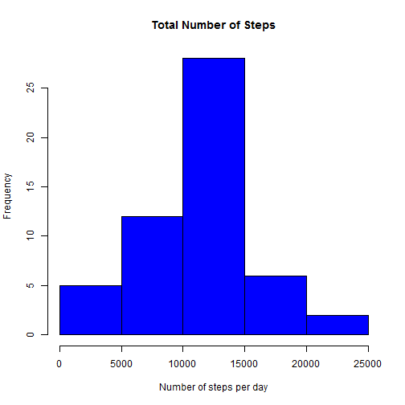
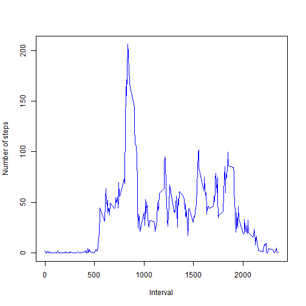
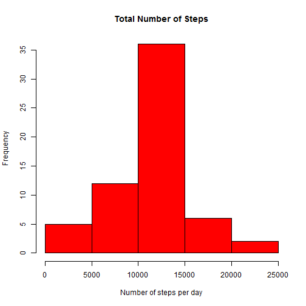
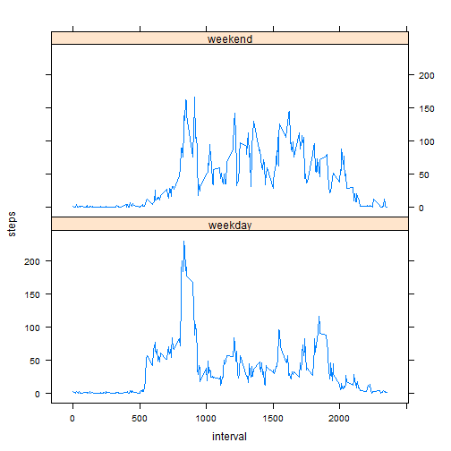

## Loading and preprocessing the data

Load data from provided dataset:


```r
unzip("activity.zip")
activity <- read.csv(file = "activity.csv", header = TRUE, sep = ",", na.strings = "NA")
```

Show data format to decide if any transformation is required:


```r
head(activity)
```

```
##   steps       date interval
## 1    NA 2012-10-01        0
## 2    NA 2012-10-01        5
## 3    NA 2012-10-01       10
## 4    NA 2012-10-01       15
## 5    NA 2012-10-01       20
## 6    NA 2012-10-01       25
```
It's applicable for current analysis and preprocessing is needed.

## What is mean total number of steps taken per day?

Histogram for total number of steps taken each day:


```r
total.steps <- aggregate(steps ~ date, activity, sum)
hist(total.steps$steps, col = "blue", xlab = "Number of steps per day", main = "Total Number of Steps")
```

 

Calculate mean and median values:


```r
mean <- mean(total.steps$steps, na.rm = T)
median <- median(total.steps$steps, na.rm = T)
```

The mean value for total number of steps taken per day is 1.0766189 &times; 10<sup>4</sup> and the median value is 10765.

## What is the average daily activity pattern?

Plot average number of steps taken during each 5-min time interval:


```r
steps.by.interval <- aggregate(steps ~ interval, activity, FUN = 'mean')
plot(steps.by.interval$interval, steps.by.interval$steps, xlab = "Interval", ylab = "Number of steps", type = "l", col = "blue")
```

 

Find the time interval with max average number of steps:


```r
max.avg.interval <- steps.by.interval[which.max(steps.by.interval$steps),]
```

835 time interval has max average number of steps = 206.1698113.

## Imputing missing values

Total number of raws with NAs:


```r
sum(is.na(activity$steps))
```

```
## [1] 2304
```

Create copy of activity dataset and replace NA values with rounded average number of steps for specific period:


```r
activity.imputed <- transform(activity, steps = ifelse(is.na(activity$steps), steps.by.interval$steps[match(activity$interval, steps.by.interval$interval)], activity$steps))
```

Histogram for imputed activity dataset:


```r
total.steps.imputed <- aggregate(steps ~ date, activity.imputed, sum)
hist(total.steps.imputed$steps, col = "red", xlab = "Number of steps per day", main = "Total Number of Steps")
```

 

Mean and median values:


```r
mean.imputed <- mean(total.steps.imputed$steps, na.rm = T)
median.imputed <- median(total.steps.imputed$steps, na.rm = T)
```

The mean value for total number of steps for imputed dataset 1.0766189 &times; 10<sup>4</sup> and the median value is 1.0766189 &times; 10<sup>4</sup>.
As we can see, mean and median values after filling in NA values became equal.


## Are there differences in activity patterns between weekdays and weekends?

Create a new factor variable in the imputed dataset with two levels - "weekday"" and "weekend":


```r
activity.imputed$weekdays <- factor(ifelse(is.element(weekdays(as.Date(activity.imputed$date)),c("Monday", "Tuesday", "Wednesday", "Thursday", "Friday")), "weekday", "weekend"))
```

Make plot to compare activities for weekdays and weekends:


```r
library(lattice)
steps.by.interval.imputed <- aggregate(steps ~ interval + weekdays, activity.imputed, FUN = 'mean')
xyplot(steps ~ interval | weekdays, data = steps.by.interval.imputed, layout = c(1, 2), type = "l")
```

 
